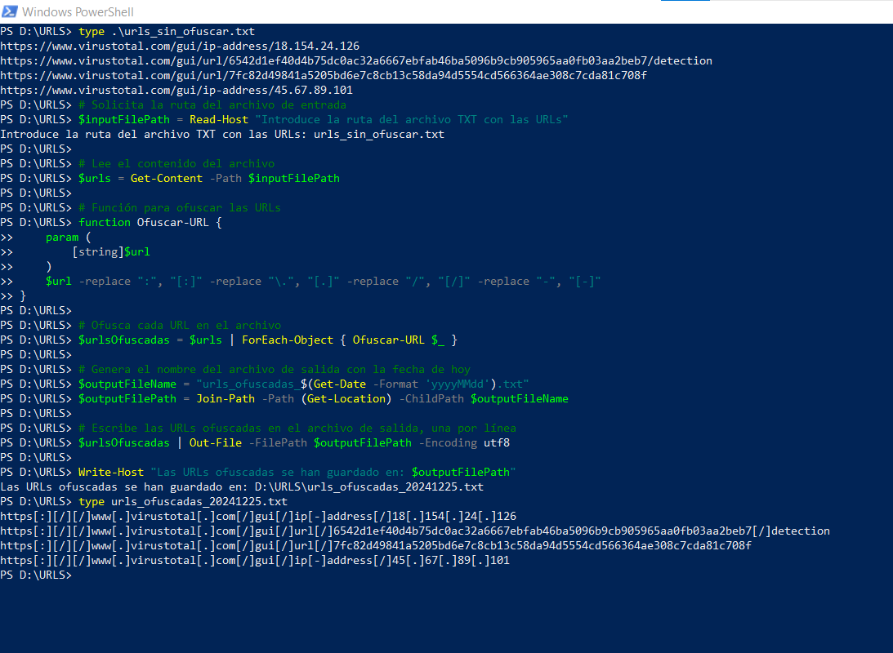

# Sanitizador

## Descripción
A continuación, adjuntaré un script en powershell para sanitizar todas las URLs o IPs que tengas en un txt y así puedas enviar cualquier reporte sin que te lo bloquee un sistema de ticketing o correo.

## Ejemplo de uso

Si deseas ejecutar este proyecto en tu máquina local, sigue estos pasos:

1. Clona este repositorio en tu máquina:
   ```powershell
   git clone https://github.com/Mactuber/sanitizador.git
2. Navega al directorio del proyecto:
   ```powershell
   cd sanitizador
3. Para usarlo debes de tener un txt con las urls o IPs sin ofuscar.

5. Ahora podrás ejecutar el script copiando y pgándolo en el terminal indicando el nombre del txt que quieres ofuscar.

## Ejemplo Práctico:

